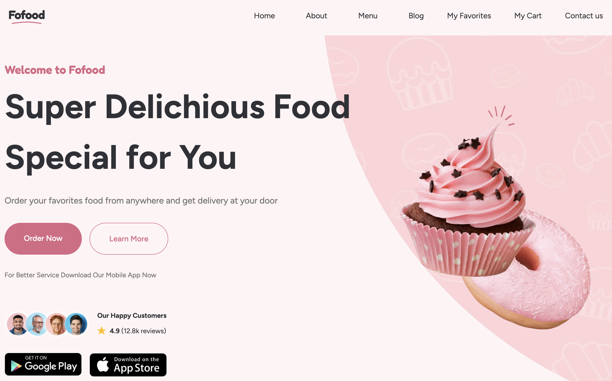

# Fofood - Dessert Shop Website

Fofood is a responsive dessert shop website built with Next.js and TypeScript.  
The project includes a product menu, cart functionality, favorites, blog pages, pagination, loading skeletons, and localStorage-based state persistence.

## Preview


## Features

- Responsive layout for desktop, tablet, and mobile
- Product menu with category-based items
- Product details page
- Add to cart functionality
- Quantity management in cart
- Remove products from cart
- Favorites page
- Blog listing with pagination
- Dynamic blog post pages using slugs
- Loading skeletons for better user experience
- Cart and favorites stored in localStorage
- Empty cart and empty favorites states
- Custom UI components and icons

## Tech Stack

- Next.js
- React
- TypeScript
- Tailwind CSS
- localStorage
- Next Image

## Project Highlights

This project demonstrates:

- Working with reusable React components
- Managing client-side state with React hooks
- Persisting cart and favorite items in localStorage
- Hydrating localStorage data from local product arrays
- Creating dynamic routes for menu items and blog posts
- Building responsive UI with Tailwind CSS
- Adding skeleton loading states for a smoother UX

## Getting Started

Clone the repository:

```
git clone https://github.com/sandra-selezen/dessert-alert.git
```

Install dependencies:

```
npm install
```

Run the development server:

```
npm run dev
```

